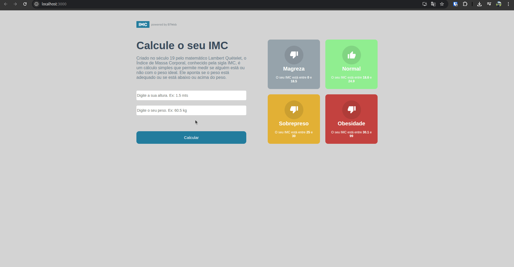

# 🏋️‍♂️ Calculadora de IMC / BMI Calculator

## pt-BR 🇧🇷

Este é um **projeto de prática** em **TypeScript** e **React** que calcula o **IMC (Índice de Massa Corporal)**.
O objetivo é **aprimorar habilidades com React, TypeScript e manipulação de estados**.

### 🔧 Como rodar o projeto

1. Clone o repositório:

```bash
git clone <URL_DO_REPOSITORIO>
```

2. Entre na pasta do projeto:

```bash
cd nome-do-projeto
```

3. Instale as dependências:

```bash
npm install
```

4. Rode o projeto:

```bash
npm start
```

Após isso, o projeto estará disponível no **localhost:3000**.

### 🎬 Como usar

Em breve será adicionado um **GIF demonstrando o funcionamento do cálculo do IMC**.



---

## English 🇺🇸

This is a **practice project** using **TypeScript** and **React** that calculates **BMI (Body Mass Index)**.
The goal is to **improve skills with React, TypeScript, and state management**.

### 🔧 How to run the project

1. Clone the repository:

```bash
git clone <REPOSITORY_URL>
```

2. Enter the project folder:

```bash
cd project-name
```

3. Install dependencies:

```bash
npm install
```

4. Start the project:

```bash
npm start
```

After this, the project will be available at **localhost:3000**.

### 🎬 How to use

A **GIF showing how to use the BMI calculator** will be added soon.


